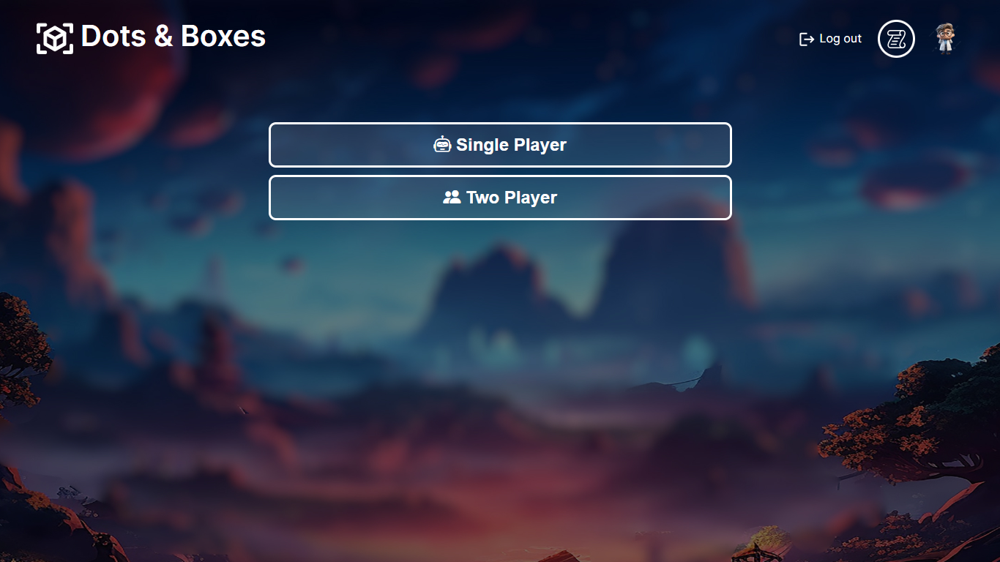
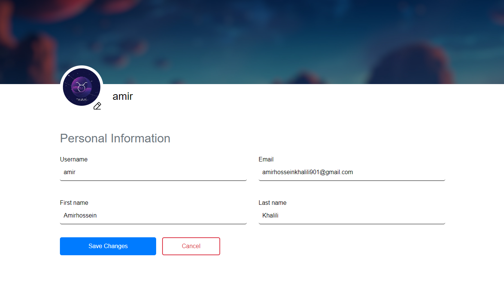
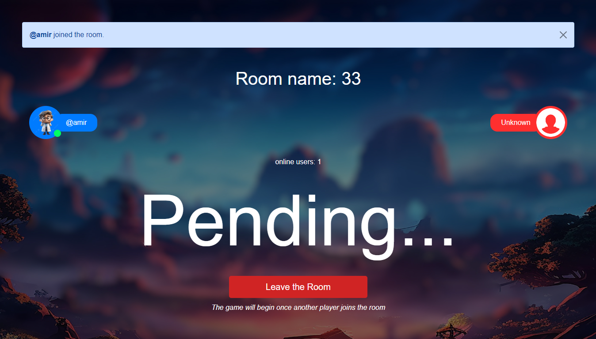
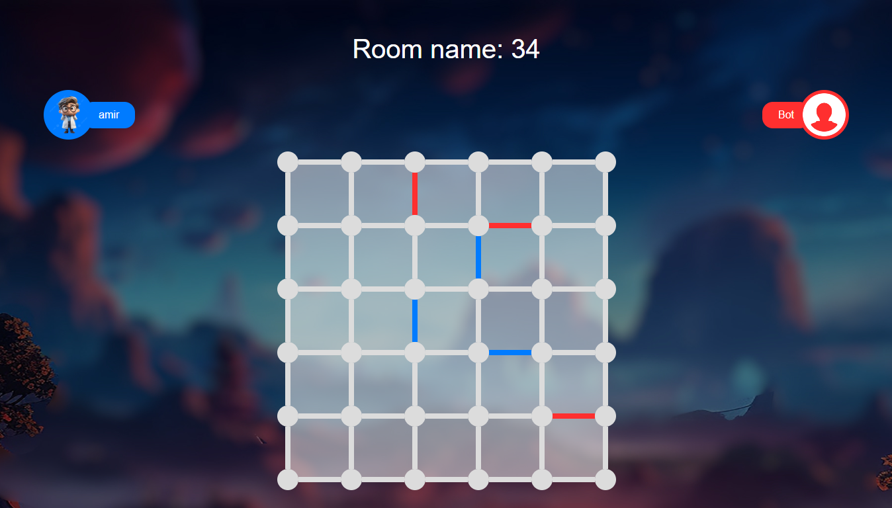
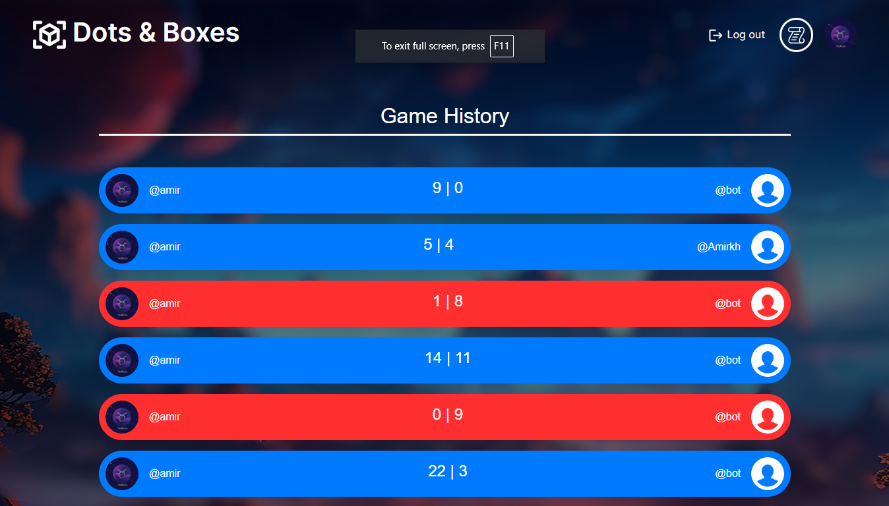

## Django Instagram Clone
Instagram clone using python django with a lot of Instagram features.

## Preview






## Features
- User authentication(Sign up and sign in).
- Single-player Game
- Two-player Game using Web-socket
- Custom User Profile
- Log Users' Activities

### Installation
- Make sure Python is installed.
- Clone the repository and change your directory to django-dots-and-boxes-local.
- Create and Activate a Virtual Environment:

  - Linux/mac: 
  ```bash
    $ pip install virtualenv
    $ virtualenv [YourVenvName]
    $ source [YourVenvName]/bin/activate
    ```
    
  - Windows:
  ```cmd
    pip install virtualenv
    python -m venv [YourVenvName]
    [YourVenvName]/Scripts/activate
  ```
  <br>

- Install required packages:
```
pip install -r requirements.txt
```

### Usage
- migrate database changes:
```
python manage.py makemigrations
python manage.py migrate
```
- Create a super user:
```
python manage.py createsuperuser
```
- Run the application:
```
python manage.py runserver
```
- Open the app at `localhost:8000` or `http://127.0.0.1:8000/`
